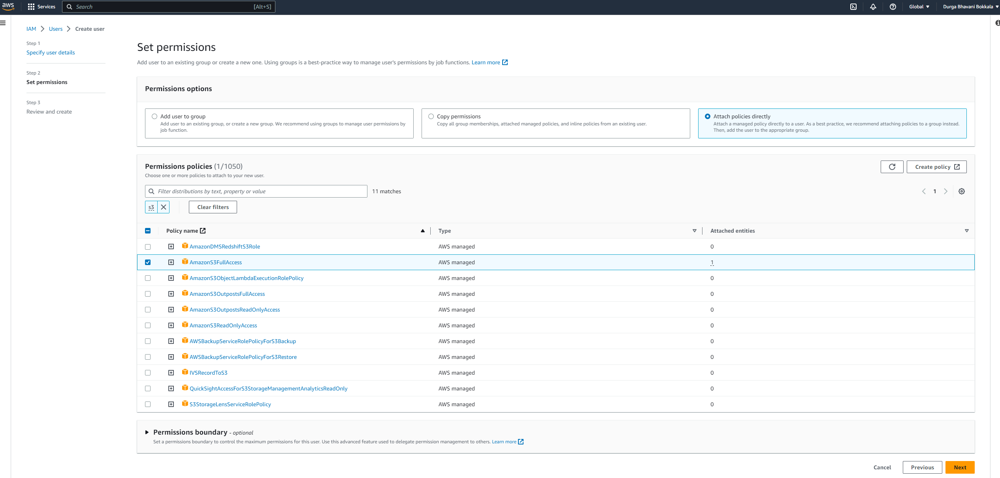
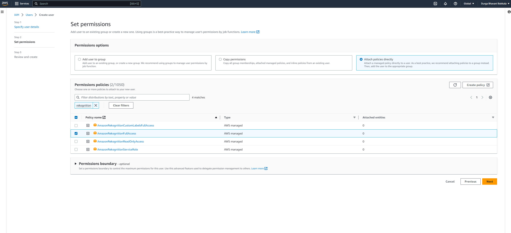
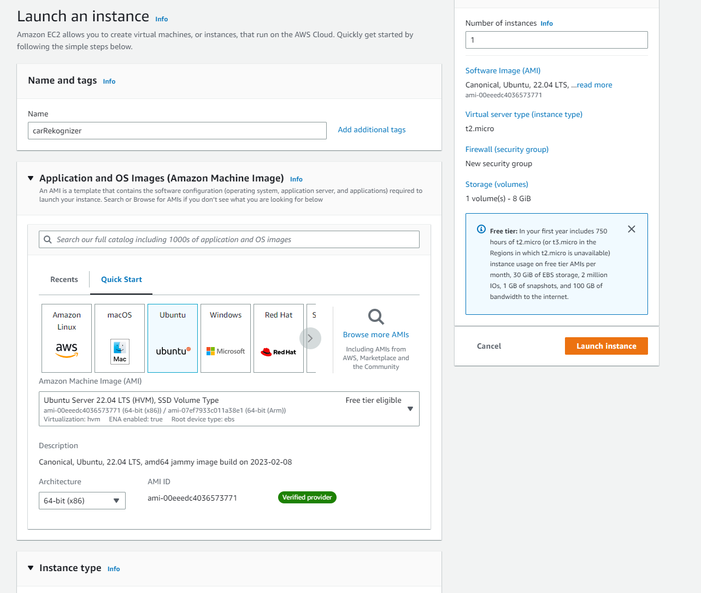

## Introduction
This project demonstrates distributed computing on the cloud, and requires two instances on the cloud: one for recognizing car images and one for extracting text from images.

## Intial steps for AWS Credentials - accesskey and accessid

To connect to the Rekognition service and SQS, our application requires AWS credentials. Follow these steps to create an AWS account and obtain access keys and IDs:

  1. Create an AWS account using your NJIT email.
  1. Access the AWS account and navigate to IAM to set up credentials for the application.
  1. Create a new user for the application in IAM with full access permissions for Rekognition, S3, and SQS.
    
    
  1. Create access and secret keys for the user and download them in .csv format.

## Steps to spinup EC2 instances

To set up the cloud environment, we will spin up two EC2 instances. Follow these steps to do so using the 12-month free tier plan:

  1. Search for "EC2" and select the first result.
  1. Navigate to "Instances" in the left-hand menu.
  1. Click "Launch Instances."
  1. Choose the "Ubuntu" option.

      

  1. In "Network Settings," ensure that SSH is checked.
  1. Create a login key pair for the instance.
  1. Launch the instance.

## Connecting to the EC2 instance using ssh

To connect to the EC2 instance using SSH, follow these steps:

  1. Update the .pem file's permissions by running the command "chmod 400 <key name>.pem."
  1. SSH into the created instance using the command "ssh -i "~/<key name>.pem" ec2-user@<YOUR_EC2_INSTANCE_PUBLIC_IPV4_ADDRESS>."

## Set up the instance to run application

  Once you have connected, install java and maven as its required by our project using following commands:
  ```sh
    sudo apt-get update
    sudo apt install default-jdk
    sudo apt-get -y install maven
  ```
*Reference: [https://www.hostinger.com/tutorials/how-to-install-maven-on-ubuntu](https://www.hostinger.com/tutorials/how-to-install-maven-on-ubuntu)*

## Running the application on EC2 instance

### Car Recognizer

To run the carImageRecognition part of the project on EC2 instance A, follow these steps:


1. Log into EC2 instance A and clone the repository using the command `git clone https://github.com/durga-db222/cs643-rekognition-distributed.git.`
1. Use the following commands to run the carImageRecognition part of the project:

```sh
cd cs643-rekognition-distributed/carTextRekognition/
mvn install
mvn exec:java@carRekognizer
```

### Text Extractor

To run the textExtractor part of the project on EC2 instance B, follow these steps:

1. SSH into EC2 instance B and clone the repository using the command `git clone https://github.com/durga-db222/cs643-rekognition-distributed.git.`
1. Use the following commands to run the textExtractor part of the project:

```sh
cd cs643-rekognition-distributed/carTextRekognition/
mvn install
mvn exec:java@textRekognizer
```

### Seeing the output

To see the output from the textExtractor, use the following command:

```sh
cat /tmp/textOutput.txt
```